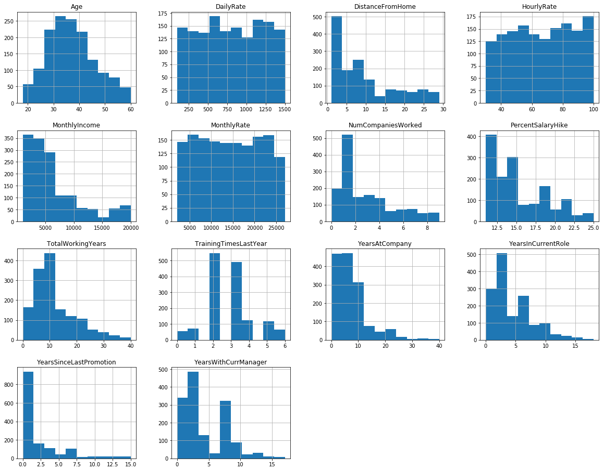
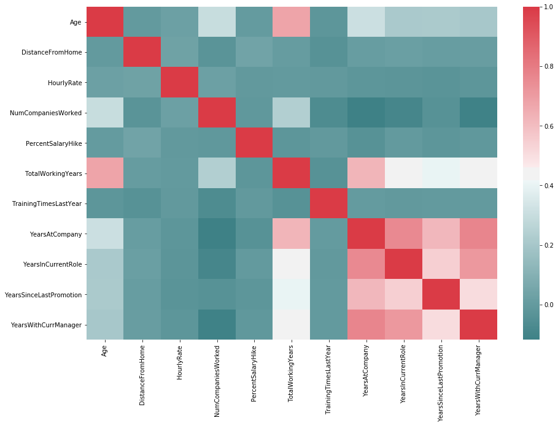
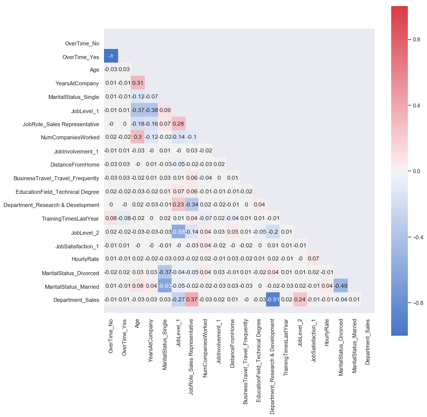
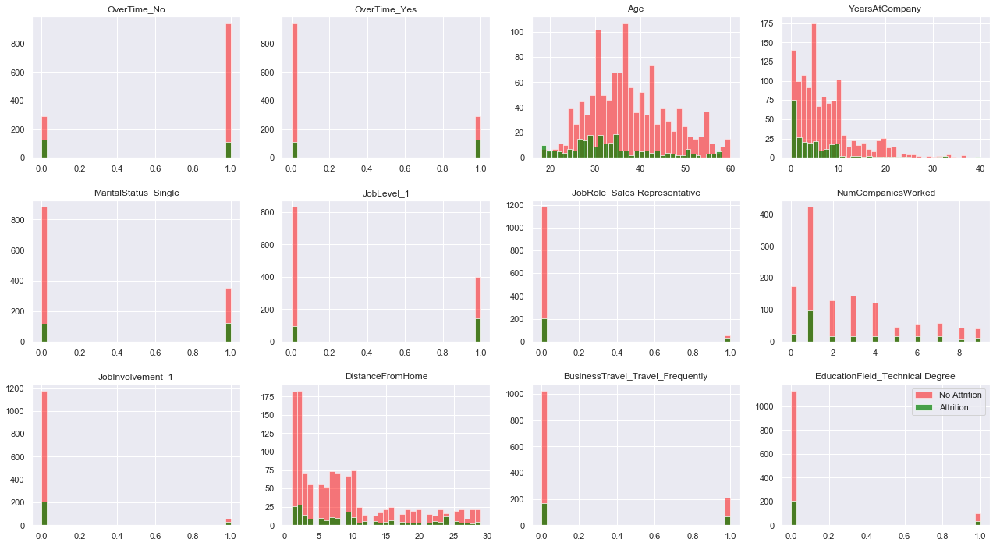
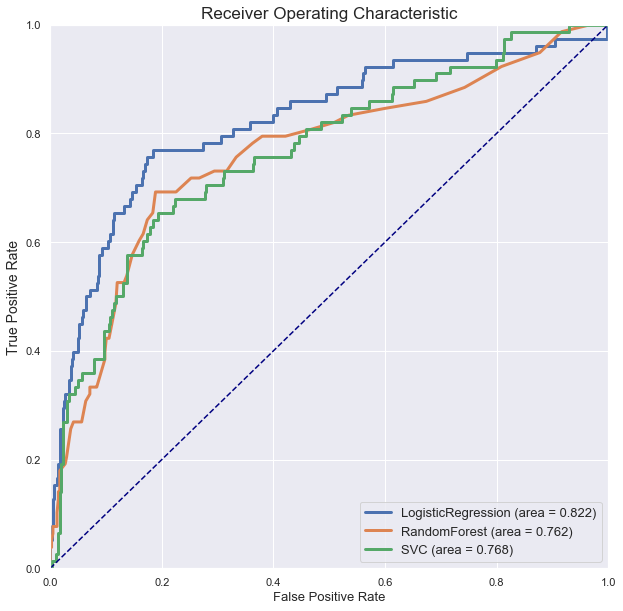

```python
import pandas as pd
import numpy as np
from scipy.optimize import curve_fit
from scipy.optimize import fsolve
import matplotlib.pyplot as plt
import seaborn as sns
import matplotlib.dates as mdates
import time
import warnings
warnings.filterwarnings("ignore")
from sklearn.model_selection import cross_val_score, KFold, StratifiedKFold
from sklearn.metrics import mean_squared_error
from sklearn.model_selection import train_test_split
from sklearn.linear_model import LogisticRegression
from sklearn import metrics
from sklearn.pipeline import Pipeline
from sklearn.preprocessing import LabelEncoder
from sklearn import preprocessing
from sklearn.preprocessing import MinMaxScaler
from sklearn.feature_selection import SelectFromModel
from sklearn.ensemble import RandomForestClassifier
from sklearn.svm import LinearSVC, SVC
from sklearn.metrics import confusion_matrix, classification_report
from sklearn.metrics import accuracy_score, precision_score, recall_score, f1_score, auc, roc_curve, log_loss
SEED = 42
%matplotlib inline
```


```python
# import data into a PANDAS dataframe, make a working copy
df_original = pd.read_csv("/Users/RonMBP2/Documents/1-SNHU Classes/DAT-690/Data/Attrition_Employee.csv")
df = df_original.copy()
```


```python
# drop unrelated columns
df.drop(columns = ['EmployeeCount', 'EmployeeNumber', 'StandardHours', 'Over18'], inplace=True)
#df.head(2)
```

   #############################       LABEL ENCODING       #########################################


```python
# check data types
df.dtypes
```


    Age                          int64
    Attrition                   object
    BusinessTravel              object
    DailyRate                    int64
    Department                  object
    DistanceFromHome             int64
    Education                    int64
    EducationField              object
    EnvironmentSatisfaction      int64
    Gender                      object
    HourlyRate                   int64
    JobInvolvement               int64
    JobLevel                     int64
    JobRole                     object
    JobSatisfaction              int64
    MaritalStatus               object
    MonthlyIncome                int64
    MonthlyRate                  int64
    NumCompaniesWorked           int64
    OverTime                    object
    PercentSalaryHike            int64
    PerformanceRating            int64
    RelationshipSatisfaction     int64
    StockOptionLevel             int64
    TotalWorkingYears            int64
    TrainingTimesLastYear        int64
    WorkLifeBalance              int64
    YearsAtCompany               int64
    YearsInCurrentRole           int64
    YearsSinceLastPromotion      int64
    YearsWithCurrManager         int64
    dtype: object


```python
## convert Attrition to binary response
df['Attrition'] = df['Attrition'].astype('category')
df['Attrition'] = df['Attrition'].cat.codes
df.head(2)
```


<div>
<style scoped>
    .dataframe tbody tr th:only-of-type {
        vertical-align: middle;
    }

    .dataframe tbody tr th {
        vertical-align: top;
    }

    .dataframe thead th {
        text-align: right;
    }
</style>
<table border="1" class="dataframe">
  <thead>
    <tr style="text-align: right;">
      <th></th>
      <th>Age</th>
      <th>Attrition</th>
      <th>BusinessTravel</th>
      <th>DailyRate</th>
      <th>Department</th>
      <th>DistanceFromHome</th>
      <th>Education</th>
      <th>EducationField</th>
      <th>EnvironmentSatisfaction</th>
      <th>Gender</th>
      <th>...</th>
      <th>PerformanceRating</th>
      <th>RelationshipSatisfaction</th>
      <th>StockOptionLevel</th>
      <th>TotalWorkingYears</th>
      <th>TrainingTimesLastYear</th>
      <th>WorkLifeBalance</th>
      <th>YearsAtCompany</th>
      <th>YearsInCurrentRole</th>
      <th>YearsSinceLastPromotion</th>
      <th>YearsWithCurrManager</th>
    </tr>
  </thead>
  <tbody>
    <tr>
      <th>0</th>
      <td>41</td>
      <td>1</td>
      <td>Travel_Rarely</td>
      <td>1102</td>
      <td>Sales</td>
      <td>1</td>
      <td>2</td>
      <td>Life Sciences</td>
      <td>2</td>
      <td>Female</td>
      <td>...</td>
      <td>3</td>
      <td>1</td>
      <td>0</td>
      <td>8</td>
      <td>0</td>
      <td>1</td>
      <td>6</td>
      <td>4</td>
      <td>0</td>
      <td>5</td>
    </tr>
    <tr>
      <th>1</th>
      <td>49</td>
      <td>0</td>
      <td>Travel_Frequently</td>
      <td>279</td>
      <td>Research &amp; Development</td>
      <td>8</td>
      <td>1</td>
      <td>Life Sciences</td>
      <td>3</td>
      <td>Male</td>
      <td>...</td>
      <td>4</td>
      <td>4</td>
      <td>1</td>
      <td>10</td>
      <td>3</td>
      <td>3</td>
      <td>10</td>
      <td>7</td>
      <td>1</td>
      <td>7</td>
    </tr>
  </tbody>
</table>
<p>2 rows × 31 columns</p>
</div>


```python
# STEP 1: select STRING object data types for categorical encoding
obj_df = df.select_dtypes(include=['object']).copy()
# STEP 2: convert STRING objects to CATEGORY dtype
columns = obj_df.columns.tolist()
for item in columns:
    obj_df[item] = obj_df[item].astype('category')
obj_df.dtypes
```


    BusinessTravel    category
    Department        category
    EducationField    category
    Gender            category
    JobRole           category
    MaritalStatus     category
    OverTime          category
    dtype: object


```python
# drop features that were converted separately in obj_df
df.drop(columns = ['BusinessTravel', 'Department', 'EducationField', 'Gender','JobRole', 'MaritalStatus', 'OverTime'], inplace=True)
```


```python
## convert other features to category data types that are currently mis-classified:
## n.b. python doesn't seem to accept all the variables for change at once
myList = ['JobSatisfaction','RelationshipSatisfaction', 'StockOptionLevel', 'WorkLifeBalance']
df[myList] = df[myList].astype('category')
myList2 = ['Education', 'JobLevel', 'JobInvolvement', 'EnvironmentSatisfaction']
df[myList2] = df[myList2].astype('category')
```


```python
# a suspicious feature with too few variables to include
df.PerformanceRating.unique()
```


    array([3, 4])


```python
# without a sufficent separation, this variable won't tell us anything important
df.drop(columns = 'PerformanceRating', inplace=True)
```


```python
## JOIN the two dataframes together for a working copy of the data
df_clean = pd.concat([df, obj_df], axis=1, join='outer')
df_clean.head(2)
```


<div>
<style scoped>
    .dataframe tbody tr th:only-of-type {
        vertical-align: middle;
    }

    .dataframe tbody tr th {
        vertical-align: top;
    }

    .dataframe thead th {
        text-align: right;
    }
</style>
<table border="1" class="dataframe">
  <thead>
    <tr style="text-align: right;">
      <th></th>
      <th>Age</th>
      <th>Attrition</th>
      <th>DailyRate</th>
      <th>DistanceFromHome</th>
      <th>Education</th>
      <th>EnvironmentSatisfaction</th>
      <th>HourlyRate</th>
      <th>JobInvolvement</th>
      <th>JobLevel</th>
      <th>JobSatisfaction</th>
      <th>...</th>
      <th>YearsInCurrentRole</th>
      <th>YearsSinceLastPromotion</th>
      <th>YearsWithCurrManager</th>
      <th>BusinessTravel</th>
      <th>Department</th>
      <th>EducationField</th>
      <th>Gender</th>
      <th>JobRole</th>
      <th>MaritalStatus</th>
      <th>OverTime</th>
    </tr>
  </thead>
  <tbody>
    <tr>
      <th>0</th>
      <td>41</td>
      <td>1</td>
      <td>1102</td>
      <td>1</td>
      <td>2</td>
      <td>2</td>
      <td>94</td>
      <td>3</td>
      <td>2</td>
      <td>4</td>
      <td>...</td>
      <td>4</td>
      <td>0</td>
      <td>5</td>
      <td>Travel_Rarely</td>
      <td>Sales</td>
      <td>Life Sciences</td>
      <td>Female</td>
      <td>Sales Executive</td>
      <td>Single</td>
      <td>Yes</td>
    </tr>
    <tr>
      <th>1</th>
      <td>49</td>
      <td>0</td>
      <td>279</td>
      <td>8</td>
      <td>1</td>
      <td>3</td>
      <td>61</td>
      <td>2</td>
      <td>2</td>
      <td>2</td>
      <td>...</td>
      <td>7</td>
      <td>1</td>
      <td>7</td>
      <td>Travel_Frequently</td>
      <td>Research &amp; Development</td>
      <td>Life Sciences</td>
      <td>Male</td>
      <td>Research Scientist</td>
      <td>Married</td>
      <td>No</td>
    </tr>
  </tbody>
</table>
<p>2 rows × 30 columns</p>
</div>


                        ############     END LABEL ENCODING    ###########


```python

```

  ###############################  BEGIN EXPLORATORY DATA ANALYSIS    ######################################


```python
# plot frequency counts of target variable (y)
df_clean['Attrition'].value_counts().plot('bar', color=('C0','C1')).set_title('Attrition')
```


    Text(0.5, 1.0, 'Attrition')


```python
# visualize all true numerical data in histogram plots
df_int = df_clean.select_dtypes(include=['int64'])
df_int.hist(layout=(5,4), figsize=(20,20))
plt.show()
```





```python
## SCALE finanical compensation data for a better comparison 
scaler = MinMaxScaler(feature_range=(0,1))
df_clean[['MonthlyRate', 'MonthlyIncome', 'HourlyRate', 'DailyRate']] = scaler.fit_transform(df_clean[['MonthlyRate', 'MonthlyIncome','HourlyRate', 'DailyRate']])
```


```python
# compare BOXPLOTS of similar features
# (the MonthlyIncome feature shows significant outliers; the remainder look identical in distribution)
boxplot = df_clean.boxplot(column=['MonthlyRate', 'MonthlyIncome', 'DailyRate', 'HourlyRate'])
```


```python
# drop three columns regarding finanical compensation (proxy data)
df_clean.drop(columns=['MonthlyRate', 'MonthlyIncome', 'DailyRate'], inplace=True)
```


```python
# select categorical features seperately for EDA
df_lvl = df_clean.select_dtypes(include=['category'])
```


```python
# visualize job-level data together
cats = ['BusinessTravel','OverTime','Department','JobRole']
fig, ax = plt.subplots(1, len(cats))
for i, cats in enumerate(df_lvl[cats]):
    df_lvl[cats].value_counts().plot("bar", ax=ax[i])
fig.set_size_inches(20, 5)
fig.show()
```


```python
# visualize demographic data together
cats = ['Gender','MaritalStatus','EducationField']
fig, ax = plt.subplots(1, len(cats))
for i, cats in enumerate(df_lvl[cats]):
    df_lvl[cats].value_counts().plot("bar", ax=ax[i])
fig.set_size_inches(20, 5)
fig.show()
```


```python
# plot likert-style data on boxplot
# (note outliers in StockOptionLevel)
sns.boxplot(data=df_lvl, orient='h')
```


    <matplotlib.axes._subplots.AxesSubplot at 0x1a18155c50>


```python
# drop StockOptionLevel feature that is severely skewed 
df_clean.drop(columns=['StockOptionLevel'], inplace=True)
```


```python
# create a correlation heatmap of features
df_int = df_clean.select_dtypes(include=['int64', 'float64'])
corr = df_int.corr()
plt.subplots(figsize=(15,10))
sns.heatmap(corr, xticklabels=corr.columns, yticklabels=corr.columns, cmap=sns.diverging_palette(200, 10, as_cmap=True))
```


    <matplotlib.axes._subplots.AxesSubplot at 0x1a183f25f8>





```python
# remove variables in 'red zone' that are overcorrelated with each other (highest score wins)
df_clean.drop(columns = ['YearsInCurrentRole', 'YearsWithCurrManager', 'YearsSinceLastPromotion', 'TotalWorkingYears'], inplace=True)
```


```python
df_int2 = df_clean.select_dtypes(include=['int64', 'float64'])
# create a correlation heatmap of features
corr2 = df_int2.corr()
plt.subplots(figsize=(15,10))
sns.heatmap(corr2, xticklabels=corr2.columns, yticklabels=corr2.columns, cmap=sns.diverging_palette(200, 10, as_cmap=True))
```


    <matplotlib.axes._subplots.AxesSubplot at 0x1a1a44c748>


                              ############     END EDA    ############

          ##############################  ONE-HOT ENCODING ########################################


```python
#### convert all CATEGORY dtypes to ONE-HOT ENCODING for statistical analysis
df_OHF = df_clean.select_dtypes(include=['category'])
columns = df_OHF.columns.tolist()
for item in columns:
    df_OHF = pd.get_dummies(df_OHF, columns=[item])
df_OHF.head(2)
```


<div>
<style scoped>
    .dataframe tbody tr th:only-of-type {
        vertical-align: middle;
    }

    .dataframe tbody tr th {
        vertical-align: top;
    }

    .dataframe thead th {
        text-align: right;
    }
</style>
<table border="1" class="dataframe">
  <thead>
    <tr style="text-align: right;">
      <th></th>
      <th>Education_1</th>
      <th>Education_2</th>
      <th>Education_3</th>
      <th>Education_4</th>
      <th>Education_5</th>
      <th>EnvironmentSatisfaction_1</th>
      <th>EnvironmentSatisfaction_2</th>
      <th>EnvironmentSatisfaction_3</th>
      <th>EnvironmentSatisfaction_4</th>
      <th>JobInvolvement_1</th>
      <th>...</th>
      <th>JobRole_Manufacturing Director</th>
      <th>JobRole_Research Director</th>
      <th>JobRole_Research Scientist</th>
      <th>JobRole_Sales Executive</th>
      <th>JobRole_Sales Representative</th>
      <th>MaritalStatus_Divorced</th>
      <th>MaritalStatus_Married</th>
      <th>MaritalStatus_Single</th>
      <th>OverTime_No</th>
      <th>OverTime_Yes</th>
    </tr>
  </thead>
  <tbody>
    <tr>
      <th>0</th>
      <td>0</td>
      <td>1</td>
      <td>0</td>
      <td>0</td>
      <td>0</td>
      <td>0</td>
      <td>1</td>
      <td>0</td>
      <td>0</td>
      <td>0</td>
      <td>...</td>
      <td>0</td>
      <td>0</td>
      <td>0</td>
      <td>1</td>
      <td>0</td>
      <td>0</td>
      <td>0</td>
      <td>1</td>
      <td>0</td>
      <td>1</td>
    </tr>
    <tr>
      <th>1</th>
      <td>1</td>
      <td>0</td>
      <td>0</td>
      <td>0</td>
      <td>0</td>
      <td>0</td>
      <td>0</td>
      <td>1</td>
      <td>0</td>
      <td>0</td>
      <td>...</td>
      <td>0</td>
      <td>0</td>
      <td>1</td>
      <td>0</td>
      <td>0</td>
      <td>0</td>
      <td>1</td>
      <td>0</td>
      <td>1</td>
      <td>0</td>
    </tr>
  </tbody>
</table>
<p>2 rows × 58 columns</p>
</div>


```python
# remove columns that have been ONE_HOT encoded
df_clean.drop(columns = columns, inplace=True)

# JOIN the two dataframes together
df_final = pd.concat([df_clean, df_OHF], axis=1, join='outer')
```

            ################## ADDITIONAL FEATURE SELECTION PRE-PROCESSING ##########################


```python
## for further dimension reduction, employ a RANDOM FOREST CLASSIFIER (RFC)
X, y = df_final.drop('Attrition', axis=1), df_final['Attrition']
X_train, X_test, y_train, y_test = train_test_split(X,y, test_size=0.33, random_state=42)
```


```python
# use RFC to look for top 20 features
# n.b. RFCs are effective at overcoming existing class imbalances
n = 20 
rfc = RandomForestClassifier(random_state=42, n_estimators=200, max_depth=3)
rfc_model = rfc.fit(X_train, y_train)
pd.Series(rfc_model.feature_importances_, index=X_train.columns).nlargest(20).plot(kind='barh', 
    figsize=[8, n/3], color='red').invert_yaxis()  
```


```python
# examine top 20 features for overcorrelation
top20_features = pd.Series(rfc_model.feature_importances_, index=X.columns).nlargest(20)
df_top20 = df_final.loc[:, top20_features.index]
# correlation matrix heatmap visualization
sns.set(style="darkgrid")
# Generate a mask 
mask = np.zeros_like(df_top20.corr(), dtype=np.bool)
mask[np.triu_indices_from(mask)] = True
# Plot the heatmap
fig, ax = plt.subplots(figsize=(12,12))
cmap = sns.diverging_palette(255, 10, as_cmap=True)
sns.heatmap(df_top20.corr().round(2), mask=mask, annot=True, annot_kws={"size": 12}, square=True, 
            cmap=cmap , vmin=-1, vmax=1, ax=ax) 
bottom, top = ax.get_ylim()
ax.set_ylim(bottom+0.5, top-0.5)

```


    (20.5, -0.5)





```python
df_final = df_top20
df_final = df_final.join(y)
```


```python
# plot feature/outcome distribution 
# select the top 12 features
features = list(df_final.columns)[0:12]   
ROWS, COLS = 3, 4
fig, ax = plt.subplots(ROWS, COLS, figsize=(22,12) )
row, col = 0, 0
for i, feature in enumerate(features):
    if col == COLS - 1:
        row += 1
    col = i % COLS  
    df_final[df_final.Attrition==0][feature].hist(bins=35, color='red', alpha=0.5, ax=ax[row, col]).set_title(feature)
    df_final[df_final.Attrition==1][feature].hist(bins=35, color='green', alpha=0.7, ax=ax[row, col])
    
plt.legend(['No Attrition', 'Attrition'])
fig.subplots_adjust(hspace=0.3)
```





```python
            
```


```python
                    ######################   MODELING   ######################

# define feature X and target y dataset 
X, y = df_final.drop('Attrition', axis=1), df_final['Attrition']
print('X', X.shape, 'y', y.shape)

# split data to 80:20 ratio for train/test
X_train, X_test, y_train, y_test = train_test_split(X, y, test_size=.33, random_state=SEED, stratify=y)
print('X_train, y_train', X_train.shape,' ', y_train.shape)
print('X_test, y_test', X_test.shape,' ', y_test.shape)
```

    X (1470, 20) y (1470,)
    X_train, y_train (984, 20)   (984,)
    X_test, y_test (486, 20)   (486,)


```python
# instantiation of all models
logr = LogisticRegression()
rf = RandomForestClassifier()
svc = SVC()
```


```python
# BASE CASE model evaluation
met = {'accuracy':True, 'precision':True, 'recall':True, 'f1score':True, 'rocauc':True, 'logloss':True}
mod = {'logr':True, 'rf':True,'svc':True}

# use Stratified KF to overcome class imbalance in target variable
kf = StratifiedKFold(n_splits=5, shuffle=True, random_state=SEED) 

# function to calculate metrics for base case of each algorithm 
def metric(model, X_train, X_test, y_train, y_test, name):
    # zero all metrics
    accuracy1 = accuracy2 = precision = recall = f1score = rocauc = logloss = 0.0
    # fit model to algorithm
    model.fit(X_train, y_train)
    y_pred = model.predict(X_test)
    
    # calculate metric for each model type
    if met['accuracy']:
        accuracy1 = np.mean(cross_val_score(model, X_train, y_train, cv=kf, scoring='accuracy'))
        accuracy2 = accuracy_score(y_test, y_pred)
    if met['precision']: precision = np.mean(cross_val_score(model, X_train, y_train, cv=kf, scoring='precision'))
    if met['recall']:    recall    = np.mean(cross_val_score(model, X_train, y_train, cv=kf, scoring='recall'))
    if met['f1score']:   f1score   = np.mean(cross_val_score(model, X_train, y_train, cv=kf, scoring='f1'))
    if met['rocauc']:    rocauc    = np.mean(cross_val_score(model, X_train, y_train, cv=kf, scoring='roc_auc'))
    # SVC metric
    if met['logloss']:   logloss   = log_loss(y_test, y_pred)   

    return pd.DataFrame({'model'    : [name],
                         'accuracy' : [accuracy1],
                         'acc(test)': [accuracy2],
                         'precision': [precision],
                         'recall'   : [recall],
                         'f1score'  : [f1score],
                         'rocauc'   : [rocauc],
                         'logloss'  : [logloss]})  

# initialize an empty dataframe
rpt = pd.DataFrame({'model'    : [],
                    'accuracy' : [],
                    'acc(test)': [],
                    'precision': [],
                    'recall'   : [],
                    'f1score'  : [],
                    'rocauc'   : [],
                    'logloss'  : []})


# begin if iteration for model testing
# contatenate current report onto previous report, call function: Metric
if mod['logr']: rpt = pd.concat([rpt, metric(logr, X_train, X_test, y_train, y_test, 'LogisticRegression')])
if mod['rf']:   rpt = pd.concat([rpt, metric(rf, X_train, X_test, y_train, y_test, 'RandomForest')])
if mod['svc']:  rpt = pd.concat([rpt, metric(svc, X_train, X_test, y_train, y_test, 'SVC')])

# BASE model performance report
rpt = rpt.reset_index(drop=True)
print('\nBase Case Performance Report')
display(rpt)

print('\n\nTuning Models for Optimum Performance...')

# TUNED model performance evaluation
def tuning(model, X_train, X_test, y_train, y_test, name):
    model.fit(X_train, y_train)
    optimal_th = 0.5   # start with default threshold value
    
    for i in range(0,3):
        score_list = []
        # create a list of lists of numbers from 0.0001 to 0.9999
        th_list = [np.linspace(optimal_th-0.4999, optimal_th+0.4999, 11), 
                   np.linspace(optimal_th-0.1,    optimal_th+0.1,    21), 
                   np.linspace(optimal_th-0.01,   optimal_th+0.01,   21)]
        for th in th_list[i]:
            if th<0: 
                score_list.append(-1)
                continue
            y_pred = (model.predict_proba(X_test)[:,1] >= th)
            f1scor = f1_score(y_test, y_pred)
            score_list.append(f1scor)  
        # select the maximum score from the score_list
        optimal_th = float(th_list[i][score_list.index(max(score_list))])

    print('accuracy score:')
    accuracy1 = model.score(X_train, y_train)   
    print('Training: {:.2f}%'.format(100*accuracy1))
    accuracy2 = model.score(X_test, y_test)
    print('Test set: {:.2f}%'.format(100*accuracy2))

    y_pred = (model.predict_proba(X_test)[:,1] >= 0.25)
    y_pred = model.predict(X_test)
    y_pred = (model.predict_proba(X_test)[:,1] >= 0.75)
    y_pred = (model.predict_proba(X_test)[:,1] >= optimal_th)
  
    print('Optimal threshold {:.3f}'.format(optimal_th))
    precision    = precision_score(y_test, y_pred)
    recall       = recall_score(y_test, y_pred)
    f1score      = f1_score(y_test, y_pred)
    
    print(name, 'confusion matrix: \n', confusion_matrix(y_test, y_pred))
    
    y_pred = model.predict_proba(X_test)[:,1]   
    fpr, tpr, thresholds = roc_curve(y_test, y_pred)
    rocauc       = auc(fpr, tpr)
    logloss      = log_loss(y_test, y_pred)   
  

    return pd.DataFrame({'model'    : [name],
                         'accuracy' : [accuracy1],
                         'acc(test)': [accuracy2],
                         'precision': [precision],
                         'recall'   : [recall],
                         'f1score'  : [f1score],
                         'rocauc'   : [rocauc],
                         'logloss'  : [logloss] })   

# make empty dataframe
tuned = pd.DataFrame({'model'    : [],
                    'accuracy' : [],
                    'acc(test)': [],
                    'precision': [],
                    'recall'   : [],
                    'f1score'  : [],
                    'rocauc'   : [],
                    'logloss'  : [] })


if mod['logr']:
    print('\n\n"""""" LogisticRegression """"""')
    score_list = []
    c_list = 10**np.linspace(-3,3,200)
    for c in c_list:
        logr = LogisticRegression(C = c)
        cvs = (cross_val_score(logr, X_train, y_train, cv=kf, scoring='f1')).mean()
        score_list.append(cvs)
    print('optimal cv F1 score = {:.4f}'.format(max(score_list)))
    optimal_c = float(c_list[score_list.index(max(score_list))])
    print('optimal value of C = {:.3f}'.format(optimal_c))
    logr = LogisticRegression(C = optimal_c)
    # function call to tune Logistic Regression model
    model_tuned = tuning(logr, X_train, X_test, y_train, y_test, 'LogisticRegression')
    tuned = pd.concat([tuned, model_tuned]) 
    
    
if mod['rf']:
    print('\n\n"""""" RandomForestClassifier """"""')
    score_list = []
    n_list = [100, 150, 200, 250, 300, 350, 400, 450, 500]
    for n in n_list:
        rf = RandomForestClassifier(n_estimators=n)
        cvs = (cross_val_score(rf, X_train, y_train, cv=kf, scoring='f1')).mean()
        score_list.append(cvs)  
    print('optimal F1 score = {:.4f}'.format(max(score_list)))
    optimal_n = int(n_list[score_list.index(max(score_list))])
    print('optimal n_estimators = {:.0f}'.format(optimal_n))
    rf = RandomForestClassifier(n_estimators=optimal_n)
    # function call to tune Random Forest model
    model_tuned = tuning(rf, X_train, X_test, y_train, y_test, 'RandomForest')
    tuned = pd.concat([tuned, model_tuned])   
    
    
if mod['svc']:
    print('\n\n"""""" SVC """"""')
    svc = SVC(gamma='scale', probability=True)
    # function call to tune Support Vector model
    model_tuned = tuning(svc, X_train, X_test, y_train, y_test, 'SVC')
    tuned = pd.concat([tuned, model_tuned])   
    

tuned = tuned.reset_index(drop=True)

print('\n\nAfter Tuning Hyperparameters:')
display(tuned)
print('\n')

```

    
    Base Case Performance Report


<div>
<style scoped>
    .dataframe tbody tr th:only-of-type {
        vertical-align: middle;
    }

    .dataframe tbody tr th {
        vertical-align: top;
    }

    .dataframe thead th {
        text-align: right;
    }
</style>
<table border="1" class="dataframe">
  <thead>
    <tr style="text-align: right;">
      <th></th>
      <th>model</th>
      <th>accuracy</th>
      <th>acc(test)</th>
      <th>precision</th>
      <th>recall</th>
      <th>f1score</th>
      <th>rocauc</th>
      <th>logloss</th>
    </tr>
  </thead>
  <tbody>
    <tr>
      <th>0</th>
      <td>LogisticRegression</td>
      <td>0.863814</td>
      <td>0.868313</td>
      <td>0.681742</td>
      <td>0.301815</td>
      <td>0.414765</td>
      <td>0.808989</td>
      <td>4.548331</td>
    </tr>
    <tr>
      <th>1</th>
      <td>RandomForest</td>
      <td>0.853683</td>
      <td>0.851852</td>
      <td>0.540191</td>
      <td>0.232863</td>
      <td>0.308564</td>
      <td>0.729929</td>
      <td>5.116874</td>
    </tr>
    <tr>
      <th>2</th>
      <td>SVC</td>
      <td>0.852642</td>
      <td>0.839506</td>
      <td>0.721429</td>
      <td>0.144355</td>
      <td>0.238571</td>
      <td>0.731011</td>
      <td>5.543274</td>
    </tr>
  </tbody>
</table>
</div>


    
    
    Tuning Models for Optimum Performance...
    
    
    """""" LogisticRegression """"""
    optimal cv F1 score = 0.4236
    optimal value of C = 2.222
    accuracy score:
    Training: 87.50%
    Test set: 86.83%
    Optimal threshold 0.245
    LogisticRegression confusion matrix: 
     [[358  50]
     [ 27  51]]
    
    
    """""" RandomForestClassifier """"""
    optimal F1 score = 0.3679
    optimal n_estimators = 100
    accuracy score:
    Training: 100.00%
    Test set: 84.77%
    Optimal threshold 0.200
    RandomForest confusion matrix: 
     [[331  77]
     [ 24  54]]
    
    
    """""" SVC """"""
    accuracy score:
    Training: 84.25%
    Test set: 83.74%
    Optimal threshold 0.169
    SVC confusion matrix: 
     [[350  58]
     [ 33  45]]
    
    
    After Tuning Hyperparameters:


<div>
<style scoped>
    .dataframe tbody tr th:only-of-type {
        vertical-align: middle;
    }

    .dataframe tbody tr th {
        vertical-align: top;
    }

    .dataframe thead th {
        text-align: right;
    }
</style>
<table border="1" class="dataframe">
  <thead>
    <tr style="text-align: right;">
      <th></th>
      <th>model</th>
      <th>accuracy</th>
      <th>acc(test)</th>
      <th>precision</th>
      <th>recall</th>
      <th>f1score</th>
      <th>rocauc</th>
      <th>logloss</th>
    </tr>
  </thead>
  <tbody>
    <tr>
      <th>0</th>
      <td>LogisticRegression</td>
      <td>0.87500</td>
      <td>0.868313</td>
      <td>0.504950</td>
      <td>0.653846</td>
      <td>0.569832</td>
      <td>0.822272</td>
      <td>0.341286</td>
    </tr>
    <tr>
      <th>1</th>
      <td>RandomForest</td>
      <td>1.00000</td>
      <td>0.847737</td>
      <td>0.412214</td>
      <td>0.692308</td>
      <td>0.516746</td>
      <td>0.762161</td>
      <td>0.377663</td>
    </tr>
    <tr>
      <th>2</th>
      <td>SVC</td>
      <td>0.84248</td>
      <td>0.837449</td>
      <td>0.436893</td>
      <td>0.576923</td>
      <td>0.497238</td>
      <td>0.767628</td>
      <td>0.389110</td>
    </tr>
  </tbody>
</table>
</div>


    
    


```python
## plot the performance metric scores
fig, ax = plt.subplots(4, 1, figsize=(8, 20))

ax[0].bar(tuned.model, tuned.f1score)
ax[0].set_title('F1-score')

ax[1].bar(tuned.model, tuned.rocauc)
ax[1].set_title('AUC-score')

ax[2].bar(tuned.model, tuned.logloss)
ax[2].set_title('Log-Loss-Score')

ax[3].bar(tuned.model, tuned['acc(test)'])
ax[3].set_title('Test Accuracy')

# Fine-tune figure; make subplots farther from each other, or nearer to each other.
fig.subplots_adjust(hspace=0.2, wspace=0.2)

```


```python
# plot the ROC curves
plt.figure(figsize=(10,10))


model_name = [logr, rf, svc]

for i in range(len(model_name)):
    y_pred = model_name[i].predict_proba(X_test)[:,1]
    fpr, tpr, thresholds = roc_curve(y_test, y_pred)
    plt.plot(fpr, tpr, lw=3, label=tuned.model[i] + ' (area = %0.3f)' % auc(fpr, tpr))
    #print(model_name)
fpr, tpr, thresholds = roc_curve(y_test, y_pred)

# add random (even) odds line x=y
plt.plot([0, 1], [0, 1], color='navy', lw=1.5, linestyle='--')
plt.xlim([0.0, 1.0])
plt.ylim([0.0, 1.0])
plt.xlabel('False Positive Rate', fontsize=13)
plt.ylabel('True Positive Rate', fontsize=14)
plt.title('Receiver Operating Characteristic', fontsize=17)
plt.legend(loc='lower right', fontsize=13)
plt.show()
```





    LogisticRegression(C=2.2219468609395236, class_weight=None, dual=False,
              fit_intercept=True, intercept_scaling=1, max_iter=100,
              multi_class='warn', n_jobs=None, penalty='l2', random_state=None,
              solver='warn', tol=0.0001, verbose=0, warm_start=False)


```python
print(model_name[0])
```

    LogisticRegression(C=2.2219468609395236, class_weight=None, dual=False,
              fit_intercept=True, intercept_scaling=1, max_iter=100,
              multi_class='warn', n_jobs=None, penalty='l2', random_state=None,
              solver='warn', tol=0.0001, verbose=0, warm_start=False)


```python
import statsmodels.api as sm
import statsmodels.formula.api as smf
import pylab as pl
import numpy as np
```


```python
# define feature X and target y dataset 
X, y = df_final.drop('Attrition', axis=1), df_final['Attrition']
print(X.shape)
```

    (1470, 20)


```python
# to find the most consequential coefficents of the features using the Logistic Regression model
logit_mod = sm.Logit(y,sm.add_constant(X))
logit_res = logit_mod.fit(disp=0)
```


```python
# take the exponent of log-odds ratio to find probabilities 
np.exp(logit_res.params).sort_values(ascending=False)
```


    JobInvolvement_1                     4.095803
    OverTime_Yes                         3.535055
    JobLevel_1                           3.382305
    BusinessTravel_Travel_Frequently     2.407907
    JobSatisfaction_1                    2.137910
    EducationField_Technical Degree      1.928885
    Department_Sales                     1.799159
    MaritalStatus_Single                 1.654009
    NumCompaniesWorked                   1.175534
    DistanceFromHome                     1.039560
    YearsAtCompany                       0.980112
    Age                                  0.961365
    HourlyRate                           0.919182
    TrainingTimesLastYear                0.867177
    JobRole_Sales Representative         0.711504
    MaritalStatus_Married                0.704957
    OverTime_No                          0.704644
    JobLevel_2                           0.558594
    Department_Research & Development    0.508069
    MaritalStatus_Divorced               0.458294
    const                                0.247505
    dtype: float64


```python

```


```python

```
